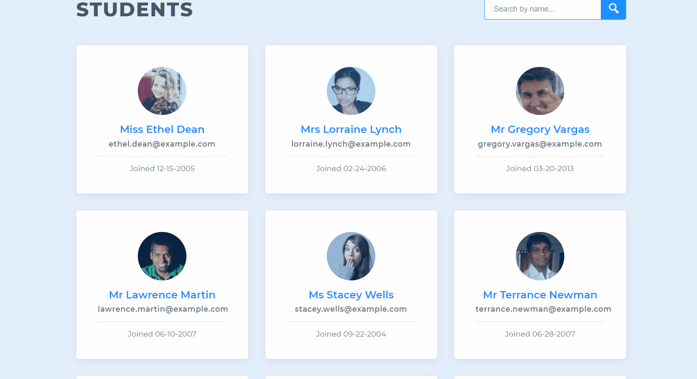

# **Data Pagination and Filtering**

## Project Description:

This project uses plain JavaScript which displays max of 9 student cards on each page and on the bottom we have option to render different page numbers. The page number dynamically changes based on number of students available. Also, there is a search feature with which we can filter out specific student based on their first or last name.

## Gify:
Here is an example
